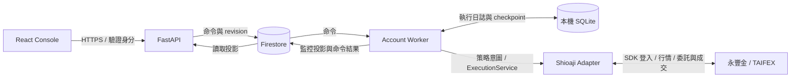

# 架構規劃

日期：2026-09-16。以下是目標設計，實作進度以 [實施清單](IMPLEMENTATION_PLAN.md) 為準。

## 1. 初期範圍

先提供帳戶控制台與台指期單腿執行，支援一帳戶一策略、多帳戶隔離。台指選擇權及跨月價差的擴充界線先定義；多主機主動容錯、同帳戶多策略、通用回測平台及分散式訊息系統暫緩。

## 2. 部署與資料流



這是三個部署單元：靜態前端、管理 API、常駐 Worker。初期沿用熟悉的 Firebase Hosting／Cloud Run／VM 方向；本機開發可全部跑在同一電腦，以 Emulator／Fake Broker 驗證。是否採 Linux Docker 在 Shioaji 版本相容驗證後確定。

Python 採單一 `backend/src/stratexec` 套件：

```text
stratexec/
├─ domain/                 # 商品、帳戶、委託、成交、金額及風險型別
├─ application/            # ExecutionService、對帳、風險、命令處理
├─ runtime/                # Worker、策略生命週期、事件佇列與投影
├─ markets/taifex/          # 交易日、時段、商品規則與單位
├─ adapters/shioaji/        # SDK、認證、代碼、回報正規化
├─ adapters/fake/           # 離線可重現的撮合與故障測試
├─ strategies/             # 驗證策略及未來正式策略
├─ persistence/            # SQLite journal、Firestore 通道
└─ api/                    # FastAPI 入口、API 模型與授權
```

以上為 P1 起逐步建立的模組，不先拆成獨立 Python SDK、策略容器或 Adapter 服務。

## 3. 每份資料只有一個負責來源

| 資料 | 負責來源 | 其他地方的角色 |
| --- | --- | --- |
| 使用者要求開始／停止 | 有版本的持久化 Command | API 只表示命令已收件 |
| 已接受命令、策略進度、intent | Worker 的 SQLite | Firestore 是只讀投影 |
| 真實委託、成交、部位、資金 | 券商回報及查詢 | journal 記錄證據、投影標示查詢時間 |
| 平台內帳戶執行權 | 一個 Worker／一個 ExecutionAuthority | Gateway 引用同一實例 |
| 是否正在管理部位 | Worker 產生的 RuntimeSnapshot | 所有前端共用同一顯示規則 |
| 已接受的策略設定 | journal 的版本化設定快照 | 編輯器草稿不直接影響運作中的策略 |

Firestore 同時有命令與監控，不代表兩邊都能決定實際策略狀態。`accepted`、`applied`、`completed` 必須分開。

## 4. 單一帳戶執行者

- Scope 按券商、環境、真實帳戶及實際子帳戶分區；venue 不應把同一期貨帳戶切成數個彼此不知情的 Worker。
- 啟動時取得主機共享的 OS 排他鎖，再開啟該帳戶的持久日誌。鎖及 SQLite volume 必須跨同主機容器共享，不能放各容器臨時層。
- 平台內同一帳戶的手動下單、策略單、撤單、平倉都進入同一 ExecutionService 串行處理；策略存在時的手動異動需由命令規則決定允許或拒絕。
- 作業系統鎖只能排除同主機重複程序。V1 每帳戶固定部署到單一主機，不支援多主機自動接手；遷機須確認舊 Worker 已停止並隔離舊端送單能力。
- 外部手機／券商軟體不受本機鎖約束，須靠回報與對帳偵測。發現外部異動時保存證據、停止自動交易並持續監控。
- 程序重啟後對帳成功才續跑相同 run；有部位時不自動改策略或改帳戶。

## 5. 交易與事件路徑

策略意圖 → ExecutionService（規格／風險／當前執行權驗證）→ intent 持久化 → Shioaji Adapter → 回報事件持久化 → 狀態與部位更新。

Adapter 將 SDK callback 放入有界的帳戶事件佇列，由單一 reducer 更新 journal。Callback 不直接修改 UI、策略狀態或送出下一筆單。委託／成交事件不可靜默丟棄；佇列溢位先關閉送單並查詢對帳。行情可合併最新值，但保留事件時間與資料品質。

下單前先記錄 `SUBMITTING`，收到券商確認再記錄 `ACKNOWLEDGED`。回報可能早於呼叫返回，也可能重複、延遲或亂序。無法確定是否送達時記錄 `UNKNOWN`，恢復後以券商證據核對，不能因本地「沒有單號」就重送。

同帳戶的新增單、取消及風險更新須重新使用最新狀態驗證。日誌寫入失敗時不再新增交易風險，保留錯誤與可用監控；不得以記憶體繼續送單。

## 6. 故障時的行為

| 情境 | Worker 行為 | 前端顯示 |
| --- | --- | --- |
| 瀏覽器關閉、API／Firestore 中斷 | 保留已接受策略；本地仍健康則繼續，結果待恢復補送 | 控制通道失聯／狀態未知，不宣稱停止 |
| 正常休市、盤間休息 | 依交易日與策略排程等待 | 等待開盤，非故障 |
| 行情／券商唯讀查詢暫時不可用 | 暫停交易動作、有上限退避，恢復後先對帳 | 恢復中及原因 |
| Session 暫時失效 | Adapter 重新驗證同帳戶、補訂閱、對帳 | 重新連線／對帳中 |
| 憑證過期或權限確定失效 | 監控保留、要求處理；不無限高速重試 | 需要處理 |
| 寫入結果不明、外部異動、帳不符 | 關閉自動送單，保持監控及證據 | 對帳阻塞，標明實際問題 |
| 程序崩潰 | supervisor 恢復 → 取得帳戶鎖 → journal 回復 → 對帳 | 復原中；成功後再顯示執行中 |

「未收到停止就維持運作」指持續管理生命週期與嘗試安全復原；資料不足時不盲目交易。健康探針只檢查本地程序，不因券商慢回應、休市或 Firestore 斷線自動重啟容器。

## 7. 命令、停止與控制通道

- Command 帶唯一 ID、帳戶、遞增 revision、期限及預期 run。Worker 將接受結果寫入 journal，再回報。
- 重送同一 ID 回傳同一結果。舊 revision、過期啟動／下單命令、錯帳戶或錯 run 明確拒絕。
- 控制通道恢復時按序讀取且先核對最新 revision；若較新停止命令已存在，不執行較舊的排隊啟動。停止命令套用到指定 run；策略不明時不改套到新 run。
- 正常停止：停止策略決策；如有部位或掛單，畫面明示「已停止自動管理／仍有曝險」，保留帳戶 Worker 與歸屬紀錄。
- 平倉並停止：獨立命令。先核對、處理策略掛單，再處理可確認歸屬的部位，逐步顯示結果；不得用「命令收到」當作「已平倉」。
- 雲端中斷時保留主機本地管理 CLI 作操作備援；走同一 Worker 命令入口，不另開券商寫入程序。主機也不可用時由操作員透過券商處理，復原後須對帳。

## 8. 前端與發布

API 輸出版本化 OpenAPI，產生 TypeScript Client。UI 對新欄位保持相容；未知 enum 顯示「版本不支援／狀態未知」，不得回退為綠燈。

前端、API、Worker 分開版本與部署。CI 的路徑檢查須計入共用契約／核心變更的下游測試，不能只看單一目錄。執行日誌 schema 有版本；回退版本不能讀新 schema 時，拒絕直接降版並使用已驗證的還原流程。
